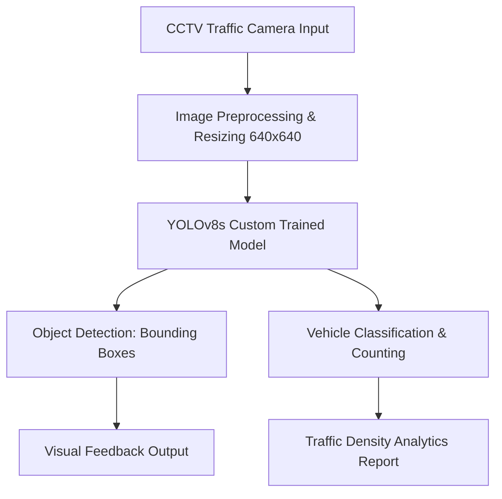

# Smart Traffic Management System using YOLOv8

An AI-powered computer vision system designed to analyze real-time traffic camera feeds, detect multiple vehicle classes, and calculate traffic density to power smart city traffic lights. This project fulfills the final requirements for the **Computer Vision Systems Development** course by SDAIA Academy.

---

## 1. Project Overview
Rapid urbanization has led to significant traffic congestion at city intersections. Traditional traffic control systems rely on fixed time intervals, which do not adapt to real-time traffic changes. This project introduces a dynamic **Smart Traffic Management System** that leverages state-of-the-art object detection to monitor traffic flow, count vehicles, and provide data-driven insights for optimizing traffic signal timings.

## 2. Problem Definition
* **The Problem:** Traffic congestion at intersections causes severe delays, increased carbon emissions, and fuel wastage due to rigid, pre-timed traffic signals.
* **System Purpose:** To automate the process of traffic monitoring by deploying a computer vision pipeline that processes live camera feeds and estimates real-time traffic volume.
* **Expected Output:** Bounding boxes around detected traffic participants, categorical classification (Car, Truck, Bus, Motorcycle, Pedestrian), and a live analytical tally (Object Counting) of the vehicle density per frame/lane.

## 3. Workflow & Architecture
The system processes input frames through a structured computer vision pipeline to extract semantic traffic information:



## 4. Dataset & Model Used
* **Dataset Source:** Traffic Dataset curated and annotated via **Roboflow**. It includes diverse traffic scenarios capturing multiple classes: `Car`, `Truck`, `Bus`, `Motorcycle`, and `Pedestrian`.
* **Preprocessing & Augmentation:** Images were resized to 640x640 pixels, with applied augmentations (horizontal flips, brightness adjustments) to ensure robust performance across varying daylight and weather conditions.
* **Model Selection:** **YOLOv8s** (Small) was chosen as the core architecture. It strikes an optimal balance between execution speed (Inference FPS) and detection accuracy, making it ideal for deployment in real-time edge applications.
* **Training Methodology:** Utilized **Transfer Learning** from pre-trained COCO weights, fine-tuning the model for **50 epochs** with a batch size of 16 on a GPU-accelerated environment.

## 5. Results & Evaluation
The model achieved high precision and recall scores across dominant classes during validation. 

📈 إجمالي مقاييس أداء النموذج (Overall Metrics):
🔹 Precision : 0.9083
🔹 Recall : 0.4336
🔹 mAP50: 0.6375
========================================

🚗 مقاييس الأداء التفصيلية لكل فئة:
📌 Bus:
   - Precision: 0.9234
   - Recall: 1.0000
📌 Car:
   - Precision: 0.8613
   - Recall: 0.4012
📌 Motorcycle:
   - Precision: 0.8485
   - Recall: 0.3333
📌 Truck:
   - Precision: 1.0000
   - Recall: 0.0000

### Performance Analysis:
* **Success Case (Accurate Detection):** The model seamlessly detects and counts vehicles under clear daylight and optimal spacing conditions, correctly separating large trucks from compact cars.
* **Failure Case (Missed/False Detection):** The system experienced occasional missed detections under heavy occlusion (e.g., a small motorcycle hidden completely behind a large bus) or extremely low-light/shadow conditions.

### Future Improvements:
1. Incorporate **SAHI (Slicing Aided Hyper Inference)** to significantly enhance the detection of small, distant vehicles.
2. Expand the training dataset with night-time and rainy weather footage to increase baseline robustness.
3. Integrate an **OCR (Optical Character Recognition)** module to capture vehicle license plates for automated law enforcement.

## 6. Optimization & Deployment
To fulfill real-world production constraints, the fine-tuned model weights (`best.pt`) were exported to the global **ONNX (Open Neural Network Exchange)** format:
* **Quantization & Speedup:** The ONNX integration reduces inference latency and shrinks the memory footprint.
* **Edge Deployment:** This optimized framework allows the system to run efficiently on low-resource hardware, such as edge AI cameras or embedded road-side units (e.g., Raspberry Pi, NVIDIA Jetson).

## 7. Technologies Used
* **Programming Language:** Python 3.x
* **Frameworks:** Ultralytics YOLOv8, PyTorch
* **Data Platform:** Roboflow
* **Deployment Format:** ONNX Runtime
* **Libraries:** OpenCV, Matplotlib, NumPy

## 8. How to Run the Project

### Prerequisites
Ensure you have Python installed, then clone this repository and install the required dependencies:
```bash
pip install ultralytics roboflow opencv-python matplotlib
```

### Run Inference & Vehicle Counting
To test the custom traffic management pipeline on a sample image/video using the optimized ONNX model, execute your local Python script or Jupyter notebook containing the core tracking code:
```python
from ultralytics import YOLO

# Load the optimized model
model = YOLO('best.onnx')

# Run prediction and count objects
results = model.predict(source='path_to_test_traffic_image.jpg', conf=0.25)
results.show()
```
●	SDAIA Academy [GitHub Repository Link](https://github.com/SDAIAAcademy)
